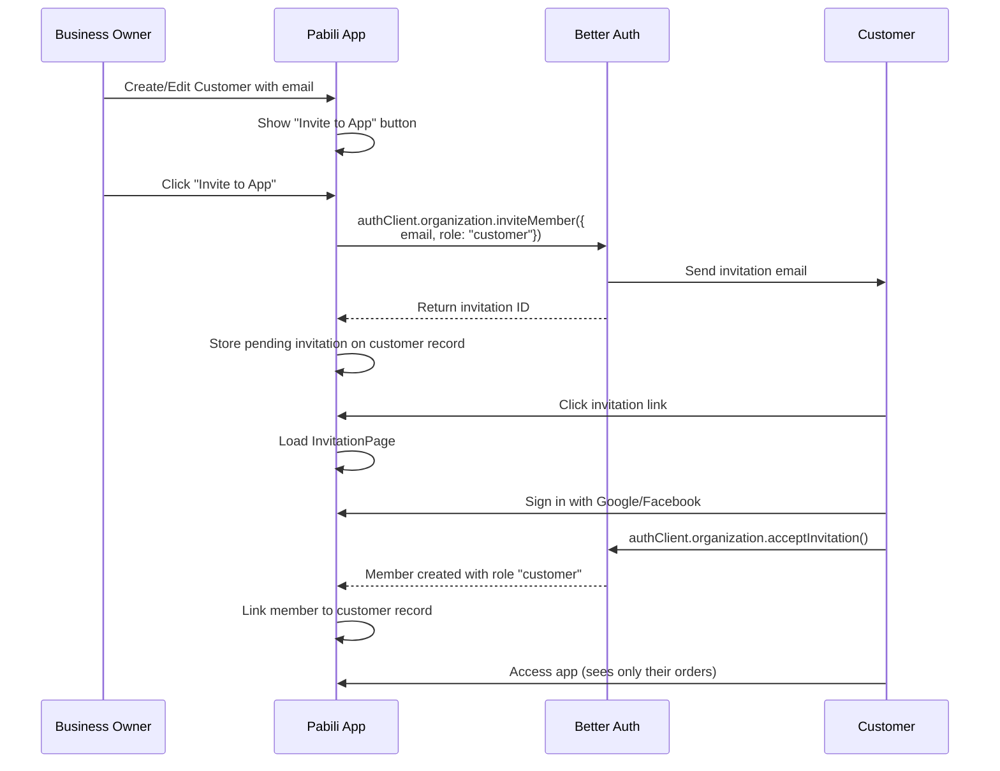

# Members Feature Implementation Plan

> **Priority:** 🟠 High | **Estimated Effort:** 2-3 weeks

## Overview

Implement a comprehensive Members management system for Pabili's multi-tenant SaaS platform. This feature enables organization owners/admins to invite team members with configurable roles like delivery, packer, back office, or custom roles. Each role defines granular permissions for data access (orders, stores, customers, payments, invoices). All members must authenticate via social login (Google/Facebook).

---

## User Review Required

> [!IMPORTANT]
> **Social Login Requirement**: Members will sign in using Google or Facebook—the same as business owners. There is no separate "member-only" auth flow. When a member accepts an invitation, they will be prompted to sign in or sign up with their social account, then automatically join the organization.

> [!WARNING]
> **Breaking Change**: The current `member` table has a simple `role` text field. This will need to support the new custom roles, which may require existing members to be migrated. Current roles (`owner`, `admin`, `member`) will be preserved and mapped to the new permission structure.

---

## Architecture Decision

### Option A: Static Custom Roles (Simpler)
Define `delivery`, `packer`, `back_office` as static roles in code alongside `owner`, `admin`, `member`.

### Option B: Dynamic Access Control (Recommended) ✅
Use Better Auth's **Dynamic Access Control** feature to store custom roles in the database. This allows:
- Per-organization custom role creation
- Runtime permission assignment
- Greater flexibility for business needs

**We recommend Option B** for SaaS scalability.

---

## Proposed Changes

### 1. Access Control System

#### [NEW] [permissions.ts](file:///home/hallauigan/pabili/src/server/auth/permissions.ts)

Define the permission statements and base roles:

```typescript
import { createAccessControl } from "better-auth/plugins/access";
import { defaultStatements, ownerAc, adminAc, memberAc } from "better-auth/plugins/organization/access";

// Define custom permission statements for Pabili resources
export const statement = {
  ...defaultStatements,
  
  // Order permissions
  order: ["view", "create", "update", "delete", "status:update"],
  
  // Store permissions
  store: ["view", "create", "update", "delete"],
  
  // Customer permissions
  customer: ["view", "create", "update", "delete"],
  
  // Invoice permissions
  invoice: ["view", "create", "update", "delete", "send"],
  
  // Payment permissions
  payment: ["view", "create", "update", "delete", "confirm"],
  
  // Report permissions
  report: ["view:summary", "view:detailed", "export"],
  
  // Member permissions (extend default)
  member: ["create", "update", "delete", "view"],
} as const;

export const ac = createAccessControl(statement);

// Base roles with full access
export const owner = ac.newRole({
  ...ownerAc.statements,
  order: ["view", "create", "update", "delete", "status:update"],
  store: ["view", "create", "update", "delete"],
  customer: ["view", "create", "update", "delete"],
  invoice: ["view", "create", "update", "delete", "send"],
  payment: ["view", "create", "update", "delete", "confirm"],
  report: ["view:summary", "view:detailed", "export"],
});

export const admin = ac.newRole({
  ...adminAc.statements,
  order: ["view", "create", "update", "delete", "status:update"],
  store: ["view", "create", "update", "delete"],
  customer: ["view", "create", "update", "delete"],
  invoice: ["view", "create", "update", "delete", "send"],
  payment: ["view", "create", "update", "delete", "confirm"],
  report: ["view:summary", "view:detailed", "export"],
});

// Default member role (basic access)
export const member = ac.newRole({
  ...memberAc.statements,
  order: ["view"],
  store: ["view"],
  customer: ["view"],
  invoice: ["view"],
  payment: ["view"],
  report: ["view:summary"],
});

// Preset roles for common business needs
export const presetRoles = {
  // Customer role - special role with row-level access
  customer: {
    name: "Customer",
    description: "Can place orders and track their own orders only",
    permissions: {
      order: ["view:own", "create:own", "update:own"],  // Row-level: only their orders
      store: ["view"],
      invoice: ["view:own"],  // Only their invoices
      payment: ["create:own", "view:own"],  // Submit payments for their orders
    },
    rowLevelAccess: true,  // Flag for special handling
  },
  delivery: {
    name: "Delivery",
    description: "Can view orders and update delivery status",
    permissions: {
      order: ["view", "status:update"],
      customer: ["view"],
      store: ["view"],
    },
  },
  packer: {
    name: "Packer",
    description: "Can view orders and update packing status",
    permissions: {
      order: ["view", "status:update"],
      store: ["view"],
    },
  },
  back_office: {
    name: "Back Office",
    description: "Can manage invoices, payments, and view reports",
    permissions: {
      order: ["view"],
      store: ["view"],
      customer: ["view", "create", "update"],
      invoice: ["view", "create", "update", "send"],
      payment: ["view", "create", "update", "confirm"],
      report: ["view:summary", "view:detailed"],
    },
  },
} as const;
```

> [!IMPORTANT]
> **Row-Level Access for Customers**: The `customer` role uses special `:own` suffixed permissions that filter data to only show records where the member is the owner (linked via `userId` on orders). This requires additional middleware logic to inject the user filter.

---

### Customer-Member Linking

When a business owner adds a customer to the app and the customer has an email, they can optionally send an invitation for the customer to access the app. This creates a **linked member** for that customer.

**Database Relationship:**
```
Customer (business entity)     Member (auth/access)
├── id                         ├── id
├── organizationId             ├── organizationId
├── customerName               ├── userId → User.id
├── customerEmail ─────────────┤ (linked via email on invite)
└── linkedMemberId ──────────→ └── role: "customer"
```

#### Customer Invitation Flow



#### Implementation: Customer Invite Handler

Add invite button to Customer edit/create page:

```typescript
// In CustomerEditPage.tsx
const handleInviteCustomer = async () => {
  if (!customer.customerEmail) {
    toast.error("Customer must have an email to invite");
    return;
  }
  
  const { data, error } = await authClient.organization.inviteMember({
    email: customer.customerEmail,
    role: "customer",
  });
  
  if (error) {
    toast.error(error.message);
    return;
  }
  
  // Store invitation reference on customer record (optional)
  await updateCustomer(customer.id, { 
    pendingInvitationId: data.id 
  });
  
  toast.success("Invitation sent to " + customer.customerEmail);
};
```

#### After Invitation Acceptance: Link Customer to Member

When the customer accepts the invitation, we need to link their new member record to the customer entity:

```typescript
// In InvitationPage.tsx after successful acceptance
const handleAccept = async () => {
  const { data, error } = await authClient.organization.acceptInvitation({
    invitationId: invitationId!,
  });
  
  if (error) return;
  
  // Find the customer by email and link the member
  // This could be done via a webhook or post-acceptance API call
  await fetch('/api/customers/link-member', {
    method: 'POST',
    body: JSON.stringify({
      email: invitation.email,
      memberId: data.memberId,
    }),
  });
  
  navigate("/");
};
```

#### Row-Level Data Filtering for Customer Role

When a user with the `customer` role accesses the app, they should only see their own orders:

```typescript
// In orders route
app.get("/", requireAuth, requireOrganization, async (c) => {
  const organizationId = c.get("organizationId");
  const session = c.get("session");
  
  // Check if user has customer role (row-level access)
  const memberRole = await auth.api.getActiveMemberRole({ headers: c.req.raw.headers });
  
  let query = db.select().from(orders)
    .where(eq(orders.organizationId, organizationId));
  
  // If customer role, filter to only their orders
  if (memberRole.role === "customer") {
    // Find the customer record linked to this member
    const customer = await db.select().from(customers)
      .where(eq(customers.linkedMemberId, session.userId))
      .get();
    
    if (customer) {
      query = query.where(eq(orders.customerId, customer.id));
    } else {
      // No linked customer, return empty
      return c.json({ success: true, data: [] });
    }
  }
  
  const result = await query;
  return c.json({ success: true, data: result });
});
```

### 2. Database Schema Changes

#### [MODIFY] [schema.ts](file:///home/hallauigan/pabili/src/server/db/schema.ts)

**Add `linkedMemberId` to customers table:**

```typescript
export const customers = sqliteTable('customers', {
  // ... existing fields ...
  
  // Link to member (for app access)
  linkedMemberId: text('linked_member_id').references(() => member.id),
  
  // ... rest of fields ...
});
```

**Add type exports for member and organization:**

```typescript
// After existing exports, add:
export type Member = typeof member.$inferSelect;
export type NewMember = typeof member.$inferInsert;

export type Organization = typeof organization.$inferSelect;
export type NewOrganization = typeof organization.$inferInsert;
```

#### [NEW] Migration: Add linkedMemberId to customers

```sql
ALTER TABLE customers ADD COLUMN linked_member_id TEXT REFERENCES member(id);
CREATE INDEX idx_customers_member ON customers(linked_member_id);
```

#### [NEW] Migration: Add Organization Role Table

Better Auth's Dynamic Access Control requires the `organizationRole` table. Generate via:

```bash
npx @better-auth/cli@latest generate
```

This creates:

| Table | Purpose |
|-------|---------|
| `organization_role` | Stores custom roles per organization with permissions JSON |

**Schema:**
```sql
CREATE TABLE organization_role (
  id TEXT PRIMARY KEY,
  name TEXT NOT NULL,
  description TEXT,
  organization_id TEXT NOT NULL REFERENCES organization(id),
  permissions TEXT NOT NULL, -- JSON: {"order": ["view", "create"], ...}
  is_preset INTEGER DEFAULT 0, -- Flag for preset vs custom roles
  created_at INTEGER NOT NULL,
  updated_at INTEGER NOT NULL
);

CREATE INDEX idx_org_role_org ON organization_role(organization_id);
CREATE UNIQUE INDEX idx_org_role_name ON organization_role(organization_id, name);
```

---

### 3. Auth Configuration Updates

#### [MODIFY] [auth.ts](file:///home/hallauigan/pabili/src/server/lib/auth.ts)

Update to include custom access control and dynamic roles:

```typescript
import { organization as organizationPlugin } from "better-auth/plugins";
import { ac, owner, admin, member } from "../auth/permissions";

// In getAuth function, update plugins:
plugins: [
  organizationPlugin({
    allowUserToCreateOrganization: true,
    ac,
    roles: { owner, admin, member },
    dynamicAccessControl: {
      enabled: true,
    },
    // Hook to initialize preset roles on org creation
    organizationCreated: async ({ organization }) => {
      // Called after org is created - consider seeding preset roles here
    },
  }),
],
```

---

### 4. Better Auth Built-in APIs

Better Auth's Organization plugin provides these APIs **out of the box**. We don't need to implement them ourselves:

#### Member Management (Built-in)

| Method | Client API | Server API | Description |
|--------|------------|------------|-------------|
| List Members | `authClient.organization.listMembers()` | `auth.api.listMembers()` | List all org members with pagination/filtering |
| Remove Member | `authClient.organization.removeMember()` | `auth.api.removeMember()` | Remove member by ID or email |
| Update Role | `authClient.organization.updateMemberRole()` | `auth.api.updateMemberRole()` | Change member role(s) |
| Get Active Member | `authClient.organization.getActiveMember()` | `auth.api.getActiveMember()` | Get current user's member details |
| Get Active Role | `authClient.organization.getActiveMemberRole()` | `auth.api.getActiveMemberRole()` | Get current user's role |
| Add Member | N/A (server only) | `auth.api.addMember()` | Add member directly (no invite) |

**Example: List Members with Pagination**
```typescript
const { data, error } = await authClient.organization.listMembers({
  query: {
    organizationId: "org-id",  // optional, uses active org if not provided
    limit: 20,
    offset: 0,
    sortBy: "createdAt",
    sortDirection: "desc",
  },
});
```

**Example: Update Member Role**
```typescript
await authClient.organization.updateMemberRole({
  memberId: "member-id",
  role: ["delivery"],  // Can be string or array for multiple roles
  organizationId: "org-id",  // optional
});
```

---

#### Invitation System (Built-in)

| Method | Client API | Server API | Description |
|--------|------------|------------|-------------|
| Invite Member | `authClient.organization.inviteMember()` | `auth.api.createInvitation()` | Send invitation email |
| Accept Invite | `authClient.organization.acceptInvitation()` | `auth.api.acceptInvitation()` | Accept pending invitation |
| Reject Invite | `authClient.organization.rejectInvitation()` | `auth.api.rejectInvitation()` | Decline invitation |
| Cancel Invite | `authClient.organization.cancelInvitation()` | `auth.api.cancelInvitation()` | Cancel pending invitation |
| Get Invite | `authClient.organization.getInvitation()` | `auth.api.getInvitation()` | Get invitation details |
| List Org Invites | `authClient.organization.listInvitations()` | `auth.api.listInvitations()` | List org's pending invites |
| List User Invites | `authClient.organization.listUserInvitations()` | `auth.api.listUserInvitations()` | List user's received invites |

**Example: Send Invitation**
```typescript
const { data, error } = await authClient.organization.inviteMember({
  email: "teammate@example.com",
  role: "delivery",  // or custom role name
  organizationId: "org-id",  // optional, uses active org
  resend: true,  // resend if already invited
});
```

**Example: Accept Invitation**
```typescript
// On the invitation acceptance page after user logs in
const { data, error } = await authClient.organization.acceptInvitation({
  invitationId: "invitation-id-from-url",
});
```

---

### 5. Invitation Email Configuration

#### [MODIFY] [auth.ts](file:///home/hallauigan/pabili/src/server/lib/auth.ts)

Configure the invitation email handler:

```typescript
import { organization as organizationPlugin } from "better-auth/plugins";
import { ac, owner, admin, member } from "../auth/permissions";
import { sendEmail } from "../lib/email"; // Your email utility

plugins: [
  organizationPlugin({
    allowUserToCreateOrganization: true,
    ac,
    roles: { owner, admin, member },
    dynamicAccessControl: {
      enabled: true,
    },
    
    // Invitation email handler
    async sendInvitationEmail(data) {
      const inviteLink = `${process.env.BETTER_AUTH_URL}/invite/${data.id}`;
      
      // Option A: Send email (requires Phase 4 email setup)
      await sendEmail({
        to: data.email,
        subject: `You've been invited to join ${data.organization.name}`,
        html: `
          <h2>Team Invitation</h2>
          <p>${data.inviter.user.name} has invited you to join ${data.organization.name}.</p>
          <p><a href="${inviteLink}">Click here to accept the invitation</a></p>
          <p>This invitation expires in 7 days.</p>
        `,
      });
      
      // Option B: For MVP without email, just log the link
      console.log(`[Invitation] Link for ${data.email}: ${inviteLink}`);
    },
    
    // Optional: Customize invitation expiry (default is 24 hours)
    invitationExpiresIn: 60 * 60 * 24 * 7, // 7 days in seconds
  }),
],
```

---

### 6. Invitation Acceptance Page

#### [NEW] [InvitationPage.tsx](file:///home/hallauigan/pabili/src/client/pages/InvitationPage.tsx)

Handle the invitation acceptance flow:

```tsx
import { useEffect, useState } from "react";
import { useParams, useNavigate } from "react-router-dom";
import { authClient, useSession } from "@/lib/auth-client";

export function InvitationPage() {
  const { invitationId } = useParams<{ invitationId: string }>();
  const { data: session, isPending: isSessionLoading } = useSession();
  const navigate = useNavigate();
  
  const [invitation, setInvitation] = useState<any>(null);
  const [status, setStatus] = useState<'loading' | 'ready' | 'accepting' | 'error'>('loading');
  const [error, setError] = useState<string | null>(null);

  // Fetch invitation details
  useEffect(() => {
    const fetchInvitation = async () => {
      const { data, error } = await authClient.organization.getInvitation({
        query: { id: invitationId! },
      });
      
      if (error) {
        setError("Invalid or expired invitation");
        setStatus('error');
        return;
      }
      
      setInvitation(data);
      setStatus('ready');
    };
    
    fetchInvitation();
  }, [invitationId]);

  // Handle accept
  const handleAccept = async () => {
    if (!session) {
      // Redirect to login, then back here
      navigate(`/login?redirect=/invite/${invitationId}`);
      return;
    }
    
    setStatus('accepting');
    const { data, error } = await authClient.organization.acceptInvitation({
      invitationId: invitationId!,
    });
    
    if (error) {
      setError(error.message || "Failed to accept invitation");
      setStatus('error');
      return;
    }
    
    // Set the new org as active and redirect
    await authClient.organization.setActive({ organizationId: data.organizationId });
    navigate("/");
  };

  // Handle decline
  const handleDecline = async () => {
    await authClient.organization.rejectInvitation({
      invitationId: invitationId!,
    });
    navigate("/");
  };

  // Render UI based on status...
}
```

#### Route Setup

Add to `App.tsx`:
```tsx
<Route path="/invite/:invitationId" element={<InvitationPage />} />
```

---

### 7. Custom API Endpoints

These are the **custom routes we need to build** on top of Better Auth:

#### [NEW] [roles.ts](file:///home/hallauigan/pabili/src/server/routes/roles.ts)

For managing custom roles (Better Auth provides the dynamic roles table, but we need UI-friendly endpoints):

```typescript
// GET /api/roles - List organization roles (built-in + custom)
// POST /api/roles - Create custom role with permissions
// PATCH /api/roles/:id - Update custom role permissions
// DELETE /api/roles/:id - Delete custom role

// GET /api/roles/presets - List available preset role templates
// POST /api/roles/presets/:key/apply - Apply preset as custom role
```

---

### 5. Client-Side Auth Updates

#### [MODIFY] [auth-client.ts](file:///home/hallauigan/pabili/src/client/lib/auth-client.ts)

Enable dynamic access control on client:

```typescript
import { createAuthClient } from "better-auth/react";
import { organizationClient } from "better-auth/client/plugins";

export const authClient = createAuthClient({
  plugins: [
    organizationClient({
      dynamicAccessControl: {
        enabled: true,
      },
    }),
  ],
});

// Export permission checking utilities
export const { 
  signIn, 
  signOut, 
  useSession, 
  useActiveOrganization,
  hasPermission, // For checking permissions
} = authClient;
```

---

### 6. UI Components

#### [NEW] [MembersSection.tsx](file:///home/hallauigan/pabili/src/client/pages/settings/MembersSection.tsx)

Member management UI within Settings page:

- **Member List**
  - Display name, email, role, status (active/pending)
  - Role badge with color coding
  - Edit/Remove actions (for admin/owner)

- **Invite Member Dialog**
  - Email input
  - Role selector (dropdown with presets + custom roles)
  - Send invitation button

- **Role Editor** (for custom roles)
  - Role name input
  - Permission checkboxes grouped by resource
  - Save/Cancel actions

#### Settings Navigation Update

Add "Members" section to Settings page:

```
/settings/members        → Member list and management
/settings/members/roles  → Role management (admin/owner only)
```

---

### 7. Permission Gate Component

#### [NEW] [PermissionGate.tsx](file:///home/hallauigan/pabili/src/client/components/auth/PermissionGate.tsx)

```tsx
interface PermissionGateProps {
  resource: 'order' | 'store' | 'customer' | 'invoice' | 'payment' | 'report' | 'member';
  action: string;
  children: React.ReactNode;
  fallback?: React.ReactNode;
}

export const PermissionGate: React.FC<PermissionGateProps> = ({
  resource,
  action,
  children,
  fallback = null,
}) => {
  const { data: session } = useSession();
  const canAccess = authClient.organization.hasPermission({
    permission: { [resource]: [action] },
  });

  if (!canAccess) return fallback;
  return children;
};

// Usage:
<PermissionGate resource="order" action="create">
  <Button>Create Order</Button>
</PermissionGate>
```

---

### 8. Permission Middleware (Server)

#### [NEW] [permissions.middleware.ts](file:///home/hallauigan/pabili/src/server/middleware/permissions.ts)

```typescript
import type { Context, Next } from "hono";
import { getAuth } from "../lib/auth";

type Resource = 'order' | 'store' | 'customer' | 'invoice' | 'payment' | 'report' | 'member';
type Action = string;

export const requirePermission = (resource: Resource, action: Action) => {
  return async (c: Context, next: Next) => {
    const auth = getAuth(c.env);
    const hasPermission = await auth.api.hasPermission({
      headers: c.req.raw.headers,
      body: {
        permission: { [resource]: [action] },
      },
    });

    if (!hasPermission?.success) {
      return c.json({ 
        success: false, 
        error: "Insufficient permissions",
        required: { resource, action },
      }, 403);
    }

    return next();
  };
};

// Usage in routes:
app.post("/orders", requireAuth, requireOrganization, requirePermission("order", "create"), async (c) => {
  // Only users with order:create permission can access
});
```

---

## Implementation Order

### Phase A: Foundation (Week 1)
1. Create `permissions.ts` with access control statements
2. Update `auth.ts` to enable dynamic access control
3. Run Better Auth CLI to generate `organization_role` table migration
4. Apply migration to database
5. Update `auth-client.ts` with dynamic access control

### Phase B: API Layer (Week 1-2)
6. Create `members.ts` route with CRUD operations
7. Create `roles.ts` route for role management
8. Add permission middleware to existing routes (orders, stores, customers, etc.)

### Phase C: UI Components (Week 2)
9. Create `MembersSection.tsx` in Settings
10. Create invite member dialog
11. Create role management UI
12. Add `PermissionGate` component

### Phase D: Integration (Week 2-3)
13. Wire up permission gates throughout the app
14. Add role badges to relevant UIs
15. Test invitation flow end-to-end
16. Create preset role seeding on org creation

---

## Verification Plan

### Automated Tests

```bash
# Test permission middleware
npm test -- src/server/middleware/permissions.test.ts

# Test role API
npm test -- src/server/routes/roles.test.ts

# Test member API
npm test -- src/server/routes/members.test.ts
```

### Manual Verification

1. **Member Invitation Flow**
   - [ ] Owner invites member via email
   - [ ] Member receives email and clicks invitation link
   - [ ] Member signs in with Google/Facebook
   - [ ] Member is added to organization with correct role
   - [ ] Member sees appropriate data based on permissions

2. **Role Assignment**
   - [ ] Owner can change member roles
   - [ ] Admin can change non-admin member roles
   - [ ] Member cannot change roles
   - [ ] Role changes take effect immediately

3. **Permission Enforcement**
   - [ ] Delivery role can view orders but cannot create
   - [ ] Packer role can update order status
   - [ ] Back office can manage payments/invoices
   - [ ] Custom roles respect configured permissions

4. **Custom Role Creation**
   - [ ] Owner can create custom role
   - [ ] Admin can create custom role
   - [ ] Custom role permissions are enforced
   - [ ] Custom role can be assigned to members

### Browser Tests

```typescript
// Test permission-based UI visibility
await page.goto('/orders');
// Verify create button visibility based on role
await expect(page.locator('[data-testid="create-order-btn"]')).toBeVisible(); // for admin
// or
await expect(page.locator('[data-testid="create-order-btn"]')).not.toBeVisible(); // for delivery
```

---

## Security Considerations

- [x] Social login only (no password management for members)
- [ ] Permission checks on every API endpoint
- [ ] Role assignment requires admin/owner permission
- [ ] Cannot demote last owner
- [ ] Cannot remove self from organization as owner
- [ ] Rate limiting on invitation endpoints
- [ ] Invitation expiry (7 days default)

---

## Dependencies

| Dependency | Phase | Required For |
|------------|-------|--------------| 
| Phase 1 Complete | Authentication | Better Auth with Organization plugin |
| Phase 4 | Notifications | Email invitation delivery |
| Phase 8 | Settings | Members UI location |
